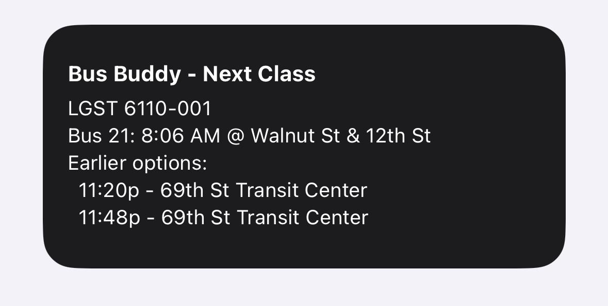

# Bus Buddy

A home screen widget that tells you which bus to catch, without opening Google Calendar or Google Maps.

## The problem

Checking the bus for an upcoming class or appointment usually means: open Google Calendar to see where you're going, then open Google Maps to figure out which bus to take and when it leaves. That's two apps and several taps for information that's fully derivable from data already sitting in your calendar.

## How Bus Buddy solves it

Bus Buddy reads your next Google Calendar event, resolves its location, and figures out the specific bus that gets you there on time — then puts that directly on your iPhone home screen as a glanceable widget. No manual lookup, no switching apps.

Concretely, it:
1. Reads your next calendar event (time + location) from Google Calendar.
2. Converts that location into a real transit route via Google's Routes API, targeting the event's *start time* — so it finds the bus that arrives on time, not just "the next bus right now."
3. Cross-references SEPTA's schedule API to also show the 2 scheduled buses before that one, in case you'd rather catch an earlier bus.
4. Renders all of this on a home screen widget that refreshes automatically in the background.

A second mode ("go home") does the same thing in reverse — from your current location to home, independent of the calendar — for trips that aren't scheduled events.

## Status

Working v1, running on an actual iPhone home screen. Built iteratively with a full PRD → roadmap → decisions log trail (see below) — this was a deliberate PM-style exercise in researching, planning, and shipping a real project, not just writing code.

## Project docs

- [PRD.md](PRD.md) — problem, goals, scope, cost, and risks
- [ROADMAP.md](ROADMAP.md) — the week-by-week build plan and what's done vs. planned (v2/v3)
- [DECISIONS.md](DECISIONS.md) — a running log of the tradeoffs made along the way and why (the most "PM" part of this repo — worth reading if you want the reasoning, not just the code)

## How it's built

- **Calendar + routing**: Google Calendar API + Google Routes API (transit mode), restricted to bus-only results
- **Real-time schedule**: SEPTA's free public bus API, for the "buses before the one I need" feature
- **The widget itself**: [Scriptable](https://scriptable.app), a free iOS app for scripting home screen widgets
- **/scripts**: Node.js prototypes used to prove out each API integration before porting the logic to Scriptable (see [scripts/README.md](scripts/README.md))
- **/widget**: the actual widget code that runs on-device (see [widget/README.md](widget/README.md) for setup)

## Setup

This is currently a personal-use project tied to one Google account and one Philadelphia address (see PRD non-goals — multi-user support is a documented future direction, not built). To run your own copy:
1. Follow [scripts/README.md](scripts/README.md) to set up Google Cloud credentials and prove out the API pipeline locally.
2. Follow [widget/README.md](widget/README.md) to get it running as an actual widget on your iPhone.
